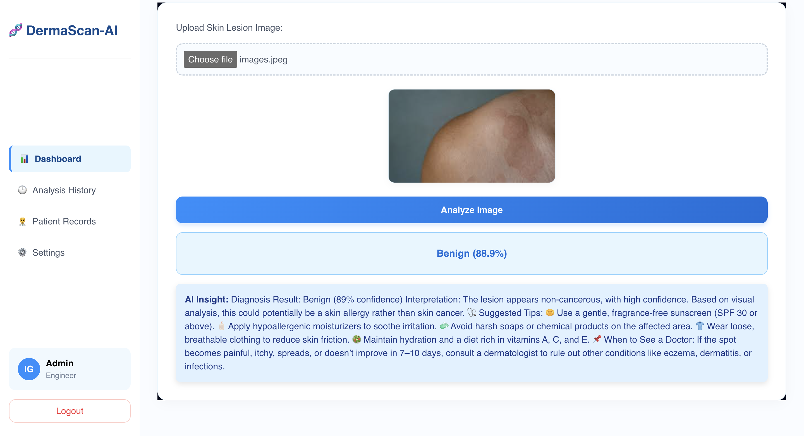
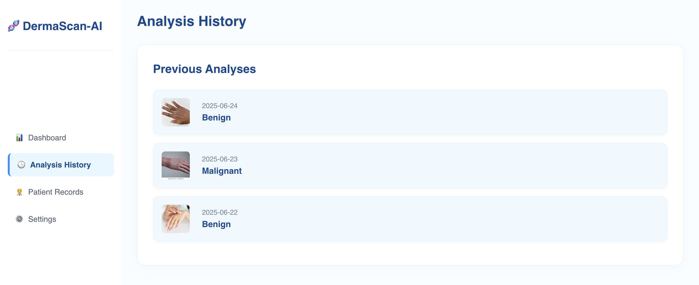
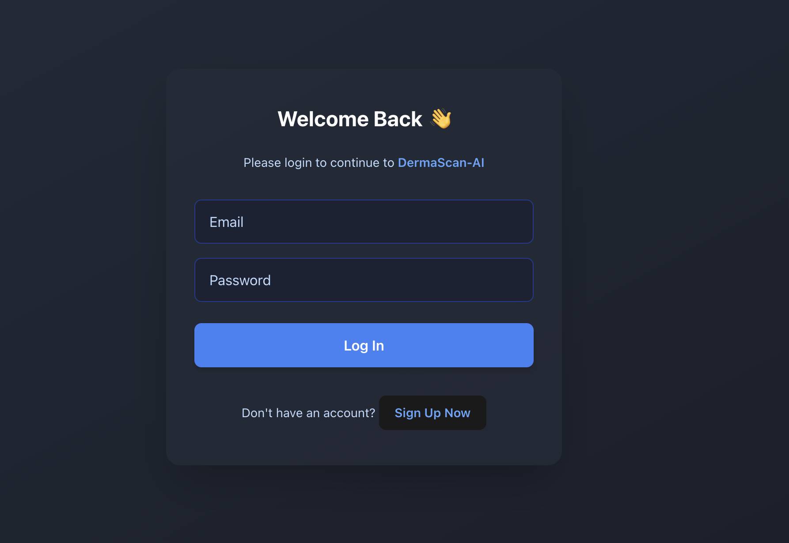
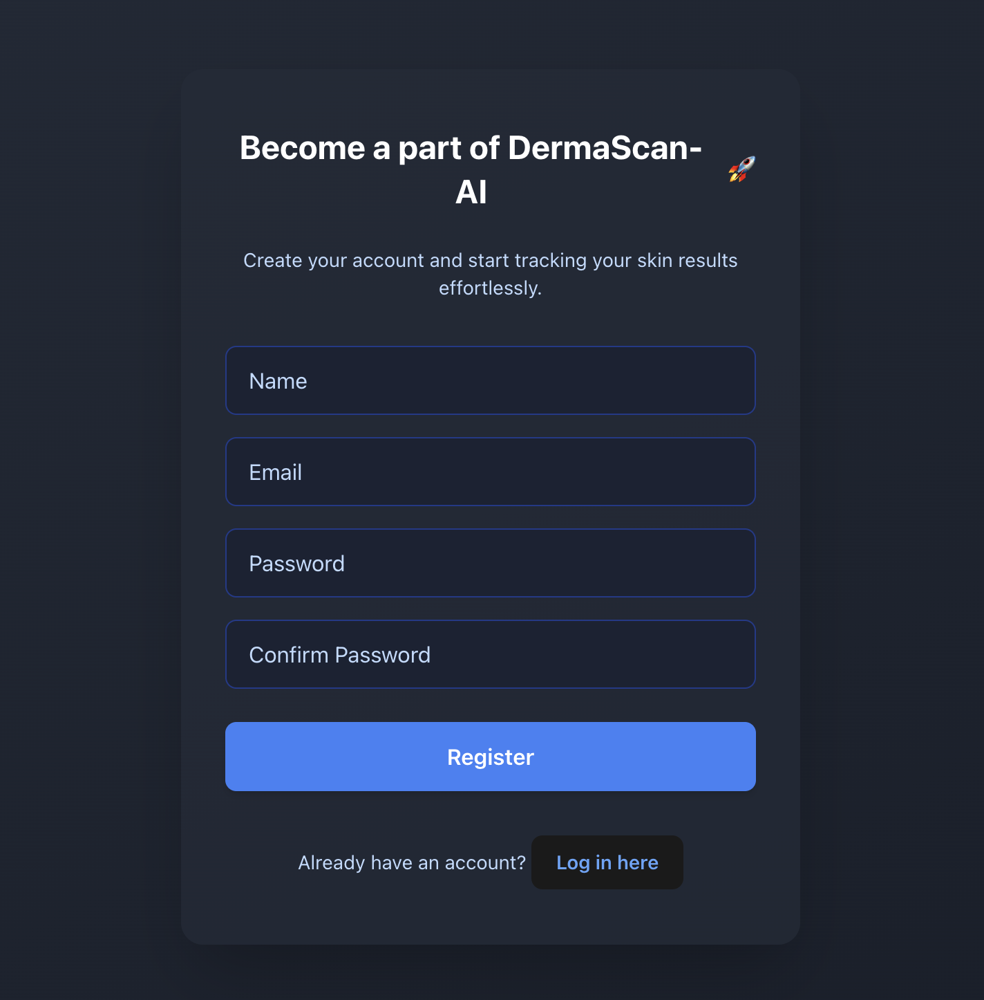

#  🌟 DermaScan-AI

**DermaScan-AI** is an AI-powered web application that analyzes skin lesion images to detect the likelihood of **benign or malignant** conditions. It also offers **personalized tips and recommendations** based on the prediction using integrated **LLM (Large Language Model)** advice.

---

## 🚀 Features

* 🗃 Upload skin lesion images
* 🤖 TensorFlow\.js model (client-side) for instant prediction
* 📊 Result with confidence score (Benign / Malignant)
* 🤠 LLM integration for actionable advice (sunscreen tips, precautions, etc.)
* 🔐 Secure login/signup using JWT + MongoDB
* 💡 Responsive & user-friendly UI built with React + Tailwind

---

---
## 📁 Project Structure

```
dermaScan/
├── frontend/         # React-based UI
│   ├── src/
│   │   ├── App.jsx
│   │   ├── AppDashboard.jsx
│   │   └── Registration.jsx
│   └── public/
│       └── model/    # TensorFlow.js model files
├── skin-cancer-backend/
│   ├── server.js     # Express server
│   ├── routes/
│   │   ├── auth.js
│   │   └── advice.js
│   ├── models/
│   │   └── user.js
│   └── .env
```

---
<p align="center">
  
</p>
---

## 🛠 Tech Stack

* **Frontend**: React, Tailwind CSS, TensorFlow.js
* **Backend**: Node.js, Express, MongoDB
* **Authentication**: JWT
* AI Model
DermaScan-AI uses a custom-trained Convolutional Neural Network (CNN) built with TensorFlow.js to analyze skin lesion images directly in the browser. The model classifies uploaded images into two categories:

Malignant (possibly cancerous)

Benign (non-cancerous)

Key features:

Runs fully in the browser — ensuring user privacy as no images are uploaded to any server.

Delivers real-time predictions with a clear confidence percentage.

Built using TensorFlow.js for smooth and responsive web integration.
* **LLM Integration**: OpenAI / Gemini API (custom advice based on result)

---
<p float="left">
  
  
</p>

---

## ⚙️ Setup Instructions

### 1. Clone the repository

```bash
git clone https://github.com/your-username/dermascan.git
cd dermascan
```

---

### 2. Setup Backend

```bash
cd skin-cancer-backend
npm install
```

#### Create `.env` file

```env
PORT=5000
MONGO_URI=mongodb://127.0.0.1:27017/dermascan
JWT_SECRET=your_super_secret_key
OPENAI_API_KEY=your_openai_key
```

#### Start the server

```bash
node server.js
```

---

### 3. Setup Frontend

```bash
cd frontend
npm install
npm run dev
```

---

## 💡 How It Works

1. User logs in or signs up
2. Uploads an image of a skin lesion
3. TensorFlow\.js model analyzes the image locally
4. Result is shown with confidence (e.g., **Malignant (92.5%)**)
5. Based on result:

   * **Benign** → sunscreen, skincare tips
   * **Malignant** → consult dermatologist, early symptoms advice
6. LLM gives context-aware tips via API response

---

## 🔐 Authentication

* Uses JWT to protect routes
* MongoDB stores user credentials securely (hashed via bcrypt)

---

## ✨ Future Improvements

* 🦬 Multi-class prediction (e.g., melanoma, carcinoma)
* 📱 PWA support for mobile
* 🌍 Upload image from camera
* 📉 View historical scans and progress over time
* 🔣 Voice assistant for skin care tips

---

## 🧑‍💻 Developed By

**Ishan** – CSE Engineering Student
Feel free to connect on [LinkedIn]([https://linkedin.com/](https://www.linkedin.com/in/ishan-gupta-7b1078281/) or contribute to the repo!

---
